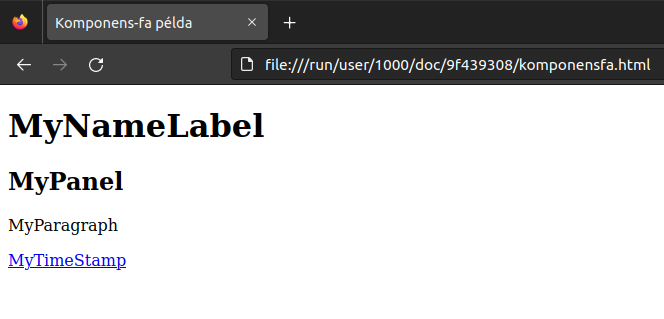

# 1. Lecke - Alapok

## Fogalmak
1. Komponens: Olyan Java objektum, amely a kirenderelt HTML-ben egy összetevőt prezentál a forráskódunkban. Ilyen Java objektum osztályának az org.apache.wicket.Component osztályból kell származnia közvetve illetve közvetlenül.
2. Komponens-fa/komponens-hierachia: Komponensek egymás tartalmazása által előálló fastruktúra.
3. Markup: Sablonként szolgáló HTML leíró. A továbbiakban kifejtésre kerülnek a markup-ok készítésének tipikus esetei.

## Komponens-fa
Az alábbi képen látható oldal

komponens-fája így néz ki:
```text
LessonOnePage
  - MyNameLabel
  - MyPanel
      - MyParagraph
      - MyTimeStampLink
        - MyTimeStamp
```

Mivel MyPage, MyPanel és MyBackLink tartalmaznak további komponenseket (Java kódban az add() metódussal hozzáadunk komponenst), ezért ők **Összetett komponensek**. Egy össztett komponens tartalmazhat további öszetett komponenseket (pl.: MyPage tartalmazza MyPanel-t). Ennél fogva egy összetett komponens maga is lehet gyerek komponens (pl.: MyPanel és MyBackLink).
Azokat a komponenseket, amelyek nem tartalmaznak további gyerek-komponenseket, őket levél-komponens-nek tekintjük. (Pl.: MyNameLabel, MyParagraph, MyTimeStamp)

## Markup-ok
Az alábbiakban megnézzük, hogy lehet a különböző komponensek HTML markup-ját elkészíteni.

### Levél komponensek markup-ja
Levél komponensek esetén az ő markup-jukat oda abba a HTML sablon-fájlban kell elkészíteni, amelyik szűlő-komponenshez fogjuk hozzáadni.
Például a MyNameLabel markup-ját a LessonOnePage komponens HTML sablonjában találjuk, mivel MyNameLabel-nek a szülője a LessonOnePage. (LessonOnePage.html, 9. sor):
```html
<h1 wicket:id="myNameLabel"></h1>
```

Hasonlóan készült el a MyParagraph markup-ja is, amelyet a LessonOnePanel HTML sablonjában találhatunk meg.

### Panel típusú összetett komponensek markup-ja
Olyan komponensek esetén, amelynek Java osztályai a org.apache.wicket.html.markup.Panel vagy a org.apache.wicket.html.markup.GenericPanel osztályokból származnak, hasonlóan a WebPage származtatott osztályokhoz, dedikált HTML markup-fájlt kell készíteni számukra, az alábbi formában:
```html
<wicket:panel>
    <!-- tartalom -->
</wicket:panel>
```
A szülőkomponensnek a markup-jában pedig így adhatjuk hozzá:
```html
<div wicket:id="<panel példámy id-ja>"></div>
```
Konkrét példának láthatjátok a LessonOnePanel HTML markup-ját és a LessonOnePage Java (LessonOnePage.java, 17. sor) és HTML (LessonOnePage.html, 12. sor) fájljait.

### Linkek markup-ja
Abban az esetben ha link levél-komponens, ugyanúgy járhatunk el, mint a többi levél-komponens estén. Tipikus példa, hogy a linkben egyszerű szöveg vagy statikus HTML elem van.
Ellenben olyan esetben, amikor a link maga egy összetett komponens, az alábbi tipikus markup-ot készítjük a szülőjének HTML markup-jában:
```html
<a wicket:id="someLink">
    <label wicket:id="someLinkLabel"></label>
</a>
```
Gyakorlati példát láthattok a LessonOnePanel Java forrásfájl 24. és 32. sorai között, illetve a LessonOnePanel.html markup-fájl 7. és 9. sora között. 