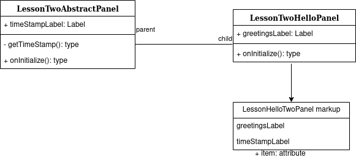
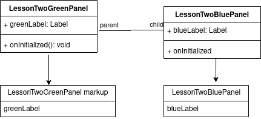

# 2. Lecke - Öröklés

## Bevezető
Az Apache Wicket támogatja az öröklést is. A következőben az öröklés két formájával ismerkedünk meg: absztrakt osztály öröklése és markup-öröklés.

## Absztrakt osztály öröklése
Ha egy absztrakt Java osztályt írunk egy komponenshez, akkor ennek a komponensnek nem kell készíteni markup-ot. Helyette a belőle származó (már nem absztrakt) komponens-osztályhoz kell úgy elkészíteni a markup-ot, hogy tartalmazza azokat a gyerekkomponenseket is, amiket az ősosztály ad hozzá.
Konkrét példaként láthatjátok a LessonTwoAbstractPanel osztályt, a LessonTwoHelloPanel Java és HTML fájlokat, amelyeket az alábbi diagram szemléltet:

A LessonTwoAbstractPanel ősosztályban felvesszük gyerek-komponensnek a timeStampLabel-t. A LessonTwoHelloPanel Java osztálya a LessonTwoAbstractPanel-ből származik emellett felveszi magához gyerek-komponensként a greetingsLabel-t is. Mivel az ősosztály absztrakt, így annak nem kell markup, viszont a belőle származó LessonTwoHelloPanel markupjába fel kellett venni a greetingsLabel-en kvül a timeStampLabel-t.

## Markup-öröklés
Az Apache Wicket keretet biztosít arra, hogy ne csak a Java osztályok, hanem a markup-ok is öröklődhessenek. Ebben az esetben mind a szülő osztályoknak, mind pedig a leszármazó osztályoknak rendelkeznie kell markup-pal. 

Az alábbiak szerint kell készíteni a markup-okat. Az ősosztály markup-jának így kell kinéznie:
```html
<wicket:panel>
    <!-- html elemek -->
    <wicket:child></wicket:child>
    <!-- további html elemek -->
</wicket:panel>
```

A ősmarkup-ban mindenképpen szükséges a wicket:panel tag-en belül valahova elhelyezni a **wicket:child** tag-et.
A származtatott komponens markup-jának pedig így kell kinéznie:
```html
<wicket:extend>
    <!-- html elemek -->
</wicket:extend>
```
Mint látható a leszármazó markup-ot a wicket:panel tag helyett a **wicket:extend** tag-gel jelöljük. Fontos, hogy az absztrakt örökléssel ellentétben itt nem kell felvenni a markup-ba az őskomponens gyerekeit, hisz annak a markup-jában már benne van.
A származtatott markup tartalma oda kerül, ahol az ősmarkup-ban el lett helyezve a **wicket:child** tag.

A lessontwo package-ben található példát szemlélteti az alábbi diagram.

A LessonTwoGreenPanel az őskomponens a saját markup-jával. Hozzá van adva mind a Java osztályban, mind a markup-ban gyereknek a greenLabel. Továbbá a markup-jában jelölve van a származtatott komponens innerHTML-jének helye **wicket:child** tag-gel.
Belőle származik a LessonTwoBluePanel, így annak a markup-ja az előbbiekben tárgyaltaknak megfelelőlen a **wicket:extend** tag-gel kezdődik. Felveszi gyerek-komponensnek a blueLabel-t mind a Java kódban, mind a markup-ban.

## Közlemény
Mivel a Page-ekre is vonatkoznak az öröklés fenti szabályai (ne feledjük, hogy a Page maga is komponens), így a 3. leckétől kezdve az egyes oldalakra a Markup-öröklés lesz alkalmazva.